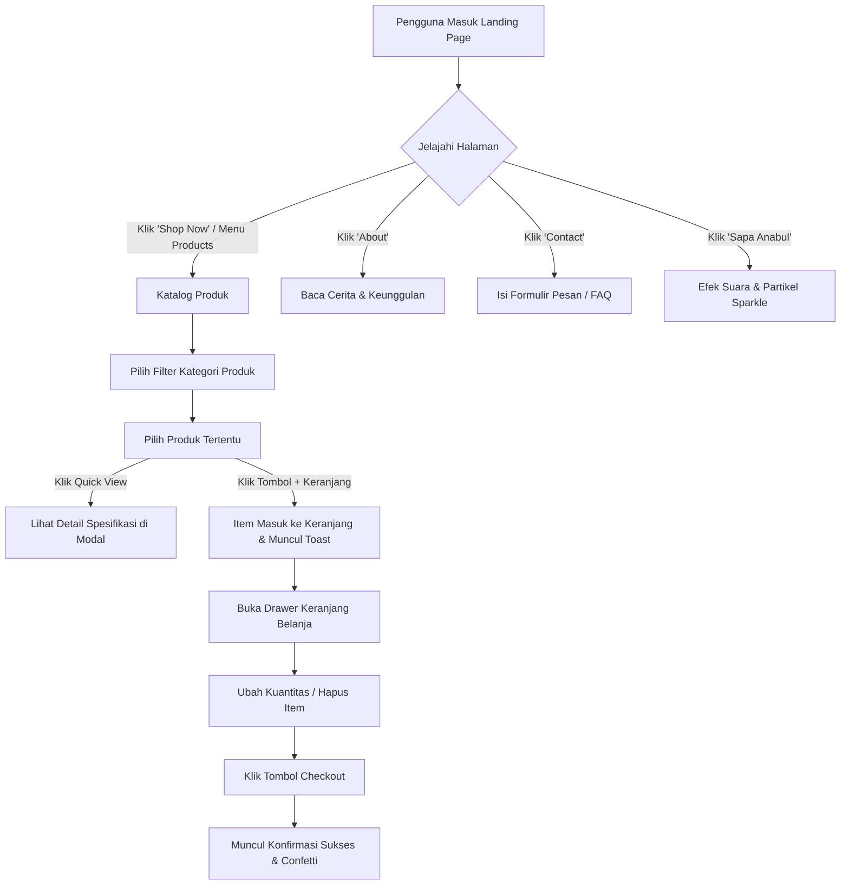

# 🐾 Dokumentasi & Alur Website Pawsy Pet Shop

Dokumentasi komprehensif rancangan, arsitektur, alur pengguna (*user flow*), sistem ikonografi, dan spesifikasi teknis untuk website landing page **Pawsy Pet Shop**.

---

## 📋 1. Ringkasan Proyek
- **Nama Brand**: Pawsy Pet Shop
- **Tagline**: *"Kebutuhan Terbaik & Paling Penuh Cinta untuk Si Anabul Kesayangan"*
- **Konsep Desain**: Cute, Clean, Modern, Friendly, dan Playful.
- **Karakter Visual**: Elemen membulat (*rounded pill & squircle*), mikro-animasi lembut (*floating, bouncy hover*), tata letak bersih (*clean layout*), dan sistem ikonografi modern berbasis vektor SVG.

---

## 🎨 2. Sistem Desain & Palet Warna Pastel

Website ini dibangun menggunakan palet warna pastel yang lembut, hangat, dan memberikan kenyamanan visual:

| Token Warna | Nilai Hex | Fungsi / Penggunaan Utama |
| :--- | :--- | :--- |
| **Cream Light / Vanilla** | `#FFFDF7` | Background dasar halaman utama (hangat & bersih) |
| **Cream Soft Card** | `#FDF8EE` / `#FAF3E0` | Background card sekunder, badge lembut, dan footer |
| **Pastel Light Blue** | `#E0F2FE` / `#BAE6FD` | Background aksen, pill badge, container fitur |
| **Sky Blue Accent** | `#38BDF8` / `#0284C7` | Tombol CTA utama, status aktif, highlight link |
| **Soft Butter Yellow** | `#FEF9C3` / `#FDE047` | Bintang rating, countdown timer, banner promo |
| **Warm Yellow Accent** | `#F59E0B` / `#D97706` | Aksen harga diskon & ikon perhatian |
| **Pure White** | `#FFFFFF` | Background card produk, drawer, dan modal pop-up |
| **Pastel Pink (Blush)** | `#FFE4E6` / `#FB7185` | Ikon wishlist/love, tag "Best Seller", easter egg |
| **Pastel Mint (Fresh)** | `#DCFCE7` / `#22C55E` | Badge "Stok Tersedia", "100% Organik" |
| **Dark Slate Text** | `#1E293B` / `#334155` | Tipografi judul dan teks utama (kontras optimal) |
| **Muted Slate Text** | `#64748B` / `#94A3B8` | Teks pendukung, tanggal ulasan, dan placeholder |

### Tipografi
1. **Heading & Brand Font**: `Fredoka`, `Quicksand`, `Poppins` (Google Fonts) – Menghadirkan kesan ramah, bulat, ceria, dan modern.
2. **Body & Interface Font**: `Quicksand`, `Inter`, `sans-serif` – Menjamin keterbacaan tinggi pada berbagai ukuran layar.

---

## 🔣 3. Sistem Ikonografi (Lucide Icons Library)

Seluruh ikon pada website menggunakan pustaka resmi **Lucide Icons** dengan format SVG vektor clean yang memiliki ketebalan garis konsisten (*stroke-width: 2.2px*). **Tidak menggunakan emoji untuk komponen antarmuka.**

### Pemetaan Ikon per Komponen:
| Komponen / Fitur | Nama Ikon Lucide | Konteks & Visual |
| :--- | :--- | :--- |
| **Brand Logo** | `paw-print` | Ikon jejak kaki anabul identitas brand Pawsy |
| **Nav Cart** | `shopping-cart` | Tombol keranjang belanja & indikator jumlah item |
| **Tombol "Shop Now"** | `shopping-bag` | Tombol aksi belanja utama |
| **Mobile Menu** | `menu` / `x` | Tombol navigasi responsif |
| **Hero Tag & Sparkle** | `sparkles` | Highlight tag keunggulan toko #1 |
| **Hero Trust Avatars** | `dog`, `cat`, `heart`, `paw-print` | Representasi anabul ramah & terpercaya |
| **Bintang Rating** | `star` (*filled*) | Indikator skor ulasan 5.0 bintang |
| **Vet Recommendation** | `stethoscope` | Badge rekomendasi nutrisi dokter hewan |
| **Diskon & Promo** | `tag`, `flame`, `gift` | Badge promo & penawaran hemat |
| **Pengiriman Cepat** | `truck` | Badge & ribbon free ongkir kilat |
| **Garansi Asli** | `shield-check` | Jaminan produk 100% original |
| **Layanan Pelanggan** | `message-circle-heart` | Dukungan konsultasi ramah |
| **Kategori Makanan** | `bone` | Pakan & cemilan bernutrisi |
| **Kategori Mainan** | `sparkles` | Mainan interaktif & aktivitas |
| **Kategori Grooming** | `bath` | Shampoo, sisir, dan kebersihan |
| **Kategori Aksesoris** | `bed` | Kasur, tempat tidur, & perlengkapan |
| **Kategori Vitamin** | `heart-pulse` / `pill` | Suplemen kesehatan & multivitamin |
| **Wishlist / Love** | `heart` | Tombol simpan produk favorit |
| **Detail Produk** | `eye` | Tombol Quick View rincian produk |
| **Tambah Keranjang** | `plus` / `shopping-cart` | Aksi memasukkan produk ke keranjang |
| **Salin Kupon** | `copy` | Tombol salin kode voucher diskon |
| **Countdown Timer** | `clock` | Ikon jam hitung mundur promo |
| **Keunggulan Toko** | `leaf`, `package-check`, `stethoscope`, `heart-handshake` | Kartu 4 pilar layanan Pawsy |
| **Tentang Kami** | `home`, `heart`, `paw-print`, `book-open`, `check` | Kartu dedikasi rumah anabul |
| **Testimoni Avatar** | `dog`, `cat` | Profil hewan peliharaan dari para pawrents |
| **Form Kontak & Lokasi** | `send`, `map-pin`, `clock`, `help-circle`, `chevron-down` | Form pesan, info toko, dan accordion FAQ |
| **Media Sosial Footer** | `instagram`, `music-2` (TikTok), `message-circle` (WhatsApp), `youtube` | Link media sosial resmi |
| **Easter Egg** | `sparkles`, `paw-print` | Tombol interaktif "Sapa Si Anabul" |
| **Drawer Keranjang** | `minus`, `plus`, `trash-2`, `check-circle` | Kontrol kuantitas, hapus item, dan checkout |

---

## 🧭 4. Struktur Halaman & Komponen

### A. Navigation Bar (Sticky with Glassmorphism)
- **Brand Logo**: Ikon `paw-print` + Tipografi *"Pawsy"* bergradasi pastel.
- **Navigasi Utama**:
  - `Home` (`#home`): Menuju puncak halaman & hero banner.
  - `Products` (`#products`): Menuju katalog produk & filter kategori.
  - `About` (`#about`): Menuju cerita, visi, dan keunggulan Pawsy.
  - `Contact` (`#contact`): Menuju formulir pesan cepat, kontak WhatsApp, & FAQ.
- **Aksi Cepat**:
  - **Tombol Keranjang** (`shopping-cart`): Membuka drawer keranjang belanja beserta badge counter item.
  - **Tombol "Shop Now"** (`shopping-bag`): Tombol CTA utama dengan efek hover bouncy.
  - **Mobile Toggle** (`menu` / `x`): Tombol hamburger responsif untuk smartphone.

---

### B. Hero Section (Banner Utama)
1. **Headline Atraktif**: *"Semua Kebutuhan Si Anabul Tersayang, Ada di Sini!"*
2. **Sub-headline**: Makanan bernutrisi, camilan sehat, mainan interaktif, hingga perlengkapan mandi terbaik dengan standar kualitas dokter hewan.
3. **CTA Buttons**:
   - `Shop Now` (Tombol utama dengan aksen Sky Blue & ikon `shopping-bag`)
   - `Lihat Promo Hari Ini` (Tombol sekunder dengan aksen Soft Yellow & ikon `gift`)
4. **Hero Badges & Micro-Cards**:
   - `stethoscope` *100% Rekomendasi Vet*
   - `tag` *Hemat s/d 30%*
   - `truck` *Gratis Ongkir Se-Indonesia*
5. **Visual Showcase**: Ilustrasi anabul menggemaskan (Kucing & Anjing ceria) dengan animasi floating.
6. **Key Value Proposition Ribbon**:
   - `shield-check` *Jaminan Produk Original 100%*
   - `truck` *Pengiriman Cepat 1 Hari Sampai*
   - `stethoscope` *Rekomendasi Dokter Hewan*
   - `message-circle-heart` *Konsultasi Perawatan Gratis 24/7*

---

### C. Katalog Produk Interaktif (*Products Section*)
1. **Filter Kategori Cepat**:
   - `layout-grid` *Semua Produk*
   - `bone` *Makanan & Snack*
   - `sparkles` *Mainan & Seru*
   - `bath` *Grooming & Mandi*
   - `bed` *Aksesoris & Kasur*
   - `heart-pulse` *Vitamin & Sehat*
2. **Fitur Kartu Produk**:
   - Wadah ikon/visual produk dengan frame pastel melengkung (*rounded 20px*).
   - Badge status: `Diskon 25%`, `Best Seller`, `Organic Choice`.
   - Tombol Love / Wishlist instan (`heart`) dengan efek meletup.
   - Rating bintang (`star` filled) dan jumlah ulasan.
   - Harga asli tercoret dan harga diskon spesial.
   - Tombol **"Quick View"** (`eye`) untuk modal rincian spesifikasi.
   - Tombol **"+ Keranjang"** (`plus`) dengan notifikasi toast konfirmasi seketika.

---

### D. Fitur Keranjang Belanja Slide-Over (*Interactive Cart Drawer*)
1. **Panel Samping Interaktif**: Terbuka secara mulus (*smooth sliding drawer*) tanpa reload halaman.
2. **Manajemen Item**:
   - Tambah & kurangi kuantitas produk (`+` / `-`).
   - Hapus item tertentu dari daftar belanja (`trash-2`).
   - Indikator keranjang kosong (*Empty State*) yang ramah dengan ikon `shopping-bag`.
3. **Perhitungan Otomatis**:
   - Subtotal harga barang.
   - Estimasi diskon promo.
   - Total akhir pesanan (*IDR*).
4. **Simulasi Checkout**:
   - Tombol *"Proses Pesanan Sekarang"* (`shopping-bag`).
   - Pop-up modal konfirmasi sukses lengkap dengan nomor resi simulasi dan efek perayaan (*celebration chime & confetti*).

---

### E. Banner Promo & Flash Sale Mingguan
- Countdown timer interaktif dengan ikon `clock` (Jam : Menit : Detik).
- Kode kupon khusus: `PAWSYLOVE20` dengan tombol salin otomatis `copy`.
- Paket bundling hemat perlengkapan anabul.

---

### F. Section "Kenapa Memilih Pawsy?" (*Why Choose Us*)
Empat pilar keunggulan dengan kartu bergradasi pastel:
1. `leaf` **Nutrisi Alami & Aman**: Bahan pilihan bebas pengawet berbahaya.
2. `package-check` **Ekstra Higienis**: Kemasan tersegel rapat dan higienis.
3. `stethoscope` **Konsultasi Gratis Dokter Hewan**: Panduan pemilihan pakan tepat.
4. `heart-handshake` **Pawsy Peduli Shelter**: Setiap pembelian mendonasikan 2% untuk shelter anabul.

---

### G. Section "Tentang Kami" (*About Us*)
- Kisah Pawsy Pet Shop yang lahir dari kecintaan mendalam terhadap hewan peliharaan.
- Ikon representatif: `home`, `heart`, `paw-print`.
- Checklist keunggulan dengan ikon `check`.
- Statistik pencapaian:
  - 🐱 **15.000+** Anabul Bahagia
  - 📦 **500+** Produk Pilihan Terbaik
  - 🎖️ **99.2%** Tingkat Kepuasan Pelanggan

---

### H. Testimoni Pelanggan (*Pawrents Feedback*)
Ulasan otentik dengan avatar anabul:
- `dog` *Luna the Golden Retriever* – "Cemilan favorit Luna selalu beli di Pawsy, bulunya makin lebat dan sehat!"
- `cat` *Mochi the British Shorthair* – "Tempat tidur dan mainan catnipnya super empuk dan lucu, pengiriman cepat banget!"
- `dog` *Milo the Toy Poodle* – "Shampoo Lavender aromanya tahan lama, tidak bikin iritasi di kulit Milo!"

---

### I. Fitur Spesial: Easter Egg "Sapa Si Anabul"
- Tombol interaktif menggemaskan di sudut halaman dengan ikon `sparkles` & `paw-print`.
- Saat diklik, membunyikan nada melodi ceria (*Web Audio API*) dan memancarkan efek partikel hati/sparkle di seluruh layar.

---

### J. Section Kontak, FAQ & Lokasi
1. **Formulir Kirim Pesan Cepat**:
   - Ikon `send` pada header dan tombol submit.
   - Input Nama, WhatsApp/Email, Jenis Hewan, dan Pesan.
   - Validasi formulir interaktif dan notifikasi toast sukses kirim.
2. **Informasi Toko**:
   - `map-pin` *Alamat: Jl. Fluffy Paw No. 88, Kebayoran Baru, Jakarta Selatan*
   - `clock` *Jam Buka: Senin - Minggu (08.00 - 21.00 WIB)*
3. **Accordion FAQ Interaktif**:
   - Ikon `help-circle` dan toggle panah `chevron-down` animasi berputar 180 derajat saat dibuka.

---

### K. Footer
- Branding Pawsy & misi kesejahteraan hewan.
- Link menu cepat.
- Kolom langganan newsletter (`send`) untuk klaim voucher diskon 15%.
- Ikon sosial media SVG resmi (`instagram`, `music-2`, `message-circle`, `youtube`).
- Hak cipta © 2026 Pawsy Pet Shop.

---

## 🔄 5. Alur Interaksi Pengguna (*User Flow*)



---

## 💻 6. Struktur Berkas (*File Architecture*)

```
c:/laragon/www/petshop/
├── alur.md                         # [Dokumentasi Lengkap Alur, Desain & Sistem Ikon Lucide]
├── public/
│   ├── index.html                  # [Halaman Landing Page Standalone / Fallback Preview]
│   ├── css/
│   │   └── style.css               # [Styling Utama: Palet Pastel, Lucide SVG Styling, Responsive]
│   └── js/
│       └── main.js                 # [Logika Interaktif: Cart, Filter, Modal, Lucide Renderer]
├── resources/
│   ├── css/
│   │   └── app.css                 # [Asset CSS Laravel]
│   ├── js/
│   │   └── app.js                  # [Asset JS Laravel]
│   └── views/
│       └── welcome.blade.php       # [Blade Template Halaman Landing Page Laravel]
└── routes/
    └── web.php                     # [Rute Web Laravel '/' -> 'welcome']
```

---

## 🚀 7. Cara Menjalankan & Menguji
1. **Via Laravel Artisan Dev Server**: Jalankan `php artisan serve`, lalu buka `http://127.0.0.1:8000`.
2. **Via Laragon / Apache Server**: Akses virtual host `http://petshop.test` atau `http://localhost/petshop/public`.
3. **Via Browser Langsung**: Buka berkas `public/index.html` langsung di browser pilihan Anda.

---
*Dokumentasi ini dibuat untuk memastikan konsistensi desain, kejelasan alur, dan kualitas kode yang bersih dan terstandarisasi.*
