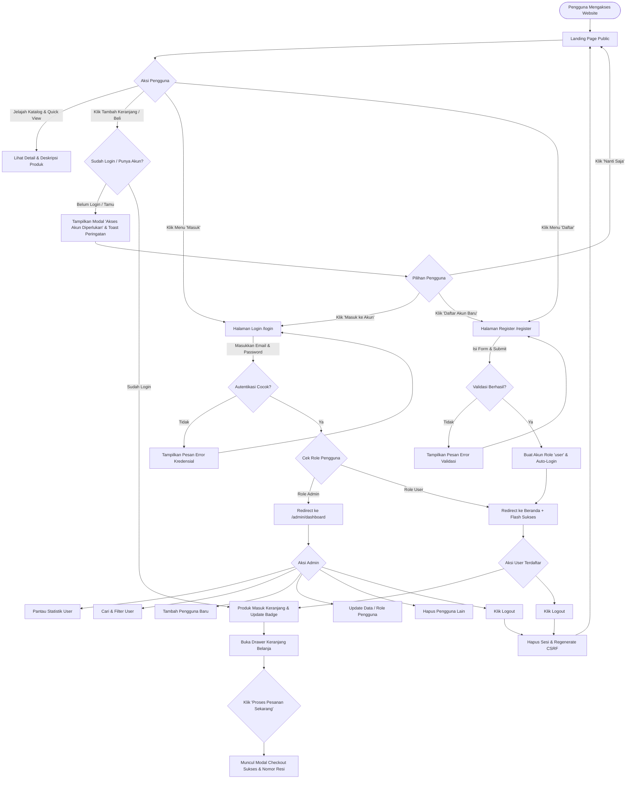

# 🐾 Dokumentasi & Alur Website Pawsy Pet Shop

Dokumentasi komprehensif rancangan, arsitektur, sistem autentikasi, proteksi keranjang & pembelian (*Guest Restriction*), manajemen hak akses (*Role-Based Access Control*), alur pengguna (*user flow*), sistem ikonografi, dan spesifikasi teknis untuk website **Pawsy Pet Shop**.

---

## 📋 1. Ringkasan Proyek
- **Nama Brand**: Pawsy Pet Shop
- **Tagline**: *"Kebutuhan Terbaik & Paling Penuh Cinta untuk Si Anabul Kesayangan"*
- **Konsep Desain**: Cute, Clean, Modern, Friendly, dan Playful.
- **Karakter Visual**: Elemen membulat (*rounded pill & squircle*), mikro-animasi lembut (*floating, bouncy hover*), tata letak bersih (*clean layout*), dan sistem ikonografi modern berbasis vektor SVG.
- **Arsitektur Sistem**: Laravel 11 MVC dengan Autentikasi Mandiri (*Custom Auth*), Middleware Proteksi Role Admin/User, Proteksi Autentikasi Keranjang/Checkout Sisi Frontend & Backend, serta Antarmuka Responsif.

---

## 🎨 2. Sistem Desain & Palet Warna Pastel

Website ini dibangun menggunakan palet warna pastel yang lembut, hangat, dan memberikan kenyamanan visual:

| Token Warna | Nilai Hex | Fungsi / Penggunaan Utama |
| :--- | :--- | :--- |
| **Cream Light / Vanilla** | `#FFFDF7` | Background dasar halaman utama & auth (hangat & bersih) |
| **Cream Soft Card** | `#FDF8EE` / `#FAF3E0` | Background card sekunder, badge lembut, dan footer |
| **Pastel Light Blue** | `#E0F2FE` / `#BAE6FD` | Background aksen, pill badge, container fitur |
| **Sky Blue Accent** | `#38BDF8` / `#0284C7` | Tombol CTA utama, status aktif, highlight link |
| **Soft Butter Yellow** | `#FEF9C3` / `#FDE047` | Bintang rating, countdown timer, banner promo |
| **Warm Yellow Accent** | `#F59E0B` / `#D97706` | Aksen harga diskon, peringatan/warning toast |
| **Pure White** | `#FFFFFF` | Background card produk, drawer, modal pop-up, form auth |
| **Pastel Pink (Blush)** | `#FFE4E6` / `#FB7185` | Ikon wishlist/love, tag "Best Seller", easter egg, modal auth |
| **Pastel Mint (Fresh)** | `#DCFCE7` / `#22C55E` | Badge "Stok Tersedia", status sukses, notifikasi alert |
| **Dark Slate Text** | `#1E293B` / `#334155` | Tipografi judul dan teks utama (kontras optimal) |
| **Muted Slate Text** | `#64748B` / `#94A3B8` | Teks pendukung, tanggal ulasan, dan placeholder input |

### Tipografi
1. **Heading & Brand Font**: `Fredoka`, `Quicksand`, `Poppins` (Google Fonts) – Menghadirkan kesan ramah, membulat, ceria, dan modern.
2. **Body & Interface Font**: `Quicksand`, `Inter`, `sans-serif` – Menjamin keterbacaan tinggi pada berbagai resolusi layar.

---

## 🔣 3. Sistem Ikonografi (Lucide Icons Library)

Seluruh ikon pada website menggunakan pustaka resmi **Lucide Icons** dengan format SVG vektor clean yang memiliki ketebalan garis konsisten (*stroke-width: 2.2px*). **Komponen antarmuka tidak menggunakan emoji statis.**

### Pemetaan Ikon per Komponen:
| Komponen / Fitur | Nama Ikon Lucide | Konteks & Visual |
| :--- | :--- | :--- |
| **Brand Logo** | `paw-print` | Ikon jejak kaki anabul identitas brand Pawsy |
| **Nav Cart** | `shopping-cart` | Tombol keranjang belanja & indikator jumlah item |
| **Tombol "Shop Now"** | `shopping-bag` | Tombol aksi belanja utama |
| **Mobile Menu** | `menu` / `x` | Tombol navigasi responsif |
| **Hero Tag & Sparkle** | `sparkles` | Highlight tag keunggulan toko #1 |
| **Hero Trust Avatars** | `dog`, `cat`, `heart`, `paw-print` | Representasi anabul ramah & terpercaya |
| **Bintang Rating** | `star` (*filled*) | Indikator skor ulasan 5.0 bintang |
| **Vet Recommendation** | `stethoscope` | Badge rekomendasi nutrisi dokter hewan |
| **Diskon & Promo** | `tag`, `flame`, `gift` | Badge promo & penawaran hemat |
| **Pengiriman Cepat** | `truck` | Badge & ribbon free ongkir kilat |
| **Garansi Asli** | `shield-check` | Jaminan produk 100% original |
| **Layanan Pelanggan** | `message-circle-heart` | Dukungan konsultasi ramah |
| **Kategori Makanan** | `bone` | Pakan & cemilan bernutrisi |
| **Kategori Mainan** | `sparkles` | Mainan interaktif & aktivitas |
| **Kategori Grooming** | `bath` | Shampoo, sisir, dan kebersihan |
| **Kategori Aksesoris** | `bed` | Kasur, tempat tidur, & perlengkapan |
| **Kategori Vitamin** | `heart-pulse` / `pill` | Suplemen kesehatan & multivitamin |
| **Wishlist / Love** | `heart` | Tombol simpan produk favorit |
| **Detail Produk** | `eye` | Tombol Quick View rincian produk |
| **Tambah Keranjang** | `plus` / `shopping-cart` | Aksi memasukkan produk ke keranjang |
| **Salin Kupon** | `copy` | Tombol salin kode voucher diskon |
| **Countdown Timer** | `clock` | Ikon jam hitung mundur promo |
| **Keunggulan Toko** | `leaf`, `package-check`, `stethoscope`, `heart-handshake` | Kartu 4 pilar layanan Pawsy |
| **Tentang Kami** | `home`, `heart`, `paw-print`, `book-open`, `check` | Kartu dedikasi rumah anabul |
| **Testimoni Avatar** | `dog`, `cat` | Profil hewan peliharaan dari para pawrents |
| **Form Kontak & Lokasi** | `send`, `map-pin`, `clock`, `help-circle`, `chevron-down` | Form pesan, info toko, dan accordion FAQ |
| **Media Sosial Footer** | `instagram`, `music-2` (TikTok), `message-circle` (WhatsApp), `youtube` | Link media sosial resmi |
| **Easter Egg** | `sparkles`, `paw-print` | Tombol interaktif "Sapa Si Anabul" |
| **Drawer Keranjang** | `minus`, `plus`, `trash-2`, `check-circle` | Kontrol kuantitas, hapus item, dan checkout |
| **Autentikasi & Akun** | `log-in`, `log-out`, `user-plus`, `lock`, `mail`, `shield-check` | Formulir login, register, modal proteksi, dan navigasi akun |
| **Admin Dashboard** | `layout-dashboard`, `users`, `user-check`, `shield-alert`, `trash-2`, `edit` | Manajemen data pengguna dan panel kontrol |

---

## 🧭 4. Struktur Halaman & Fitur Aplikasi

### A. Navigation Bar (Sticky with Glassmorphism)
- **Brand Logo**: Ikon `paw-print` + Tipografi *"Pawsy"* bergradasi pastel.
- **Navigasi Utama**:
  - `Home` (`#home`): Menuju puncak halaman & hero banner.
  - `Products` (`#products`): Menuju katalog produk & filter kategori.
  - `About` (`#about`): Menuju cerita, visi, dan keunggulan Pawsy.
  - `Contact` (`#contact`): Menuju formulir pesan cepat, kontak WhatsApp, & FAQ.
- **Aksi Cepat**:
  - **Tombol Keranjang** (`shopping-cart`): Membuka drawer keranjang belanja beserta badge counter item.
  - **Tombol "Shop Now"** (`shopping-bag`): Tombol CTA utama dengan efek hover bouncy.
  - **Status Autentikasi Pengguna**:
    - **Tamu (Guest)**: Menampilkan tombol `Masuk` (`log-in`) dan `Daftar` (`user-plus`).
    - **User Terautentikasi**: Menampilkan avatar inisial nama, nama pengguna, dan tombol `Keluar` (`log-out`).
    - **Admin Terautentikasi**: Menampilkan tombol `Dashboard` (`shield-check`), chip nama pengguna, dan tombol logout.
  - **Mobile Toggle** (`menu` / `x`): Tombol hamburger responsif untuk smartphone.

---

### B. Landing Page (Public Showcase)
1. **Hero Section**: Headline utama, ilustrasi anabul maskot (*floating animation*), CTA belanja & voucher, serta badge jaminan dokter hewan.
2. **Katalog Produk Interaktif**: Filter 6 kategori cepat (Semua, Makanan, Mainan, Grooming, Aksesoris, Vitamin), kartu produk dengan Love/Wishlist, Quick View modal, dan tombol tambah keranjang seketika.
3. **Interactive Cart Drawer (Slide-Over)**: Panel geser keranjang, perhitungan subtotal/diskon/total otomatis, pengaturan kuantitas, dan simulasi checkout.
4. **Banner Promo & Flash Sale**: Hitung mundur jam:menit:detik, kupon diskon `PAWSYLOVE20` dengan fitur salin satu-klik.
5. **Why Choose Us & About Us**: 4 pilar keunggulan bahan alami & higienis, dedikasi shelter, serta data pencapaian pelanggan.
6. **Pawrents Testimonials & Easter Egg**: Ulasan nyata pemilik anabul dan tombol melodi audio interaktif "Sapa Si Anabul".
7. **Kontak, Toko & Accordion FAQ**: Form kirim pesan cepat, jam operasional, alamat offline, dan tanya-jawab interaktif.
8. **Footer**: Newsletter voucher 15%, navigasi footer, dan tautan sosial media resmi.

---

### C. Proteksi Keranjang & Pembelian (*Guest Cart & Purchase Restriction*)

> [!IMPORTANT]
> **Aturan Bisnis & Keamanan Transaksi**:
> Pengguna yang **belum masuk (guest)** atau **belum memiliki akun** **DIBLOKIR** dari:
> 1. Menambahkan produk ke keranjang belanja (*Add to Cart* baik melalui tombol kartu produk maupun modal *Quick View*).
> 2. Melakukan checkout dan pemrosesan pembelian (*Checkout / Process Purchase*).

#### Mekanisme Proteksi & UX Interaktif:
1. **Pengecekan Status Login (*Auth State Verification*)**:
   - Status login diinjeksi secara reaktif melalui variabel global `window.PAWSY_AUTH = { isLoggedIn: true/false, loginUrl, registerUrl }`.
   - Fungsi `isUserLoggedIn()` mengecek status sesi aktif sebelum operasi manipulasi keranjang diizinkan.
2. **Modal Interaktif "Akses Akun Diperlukan" (`#authRequiredModal`)**:
   - Jika pengguna belum login mengklik tombol `+ Keranjang` atau `Masukkan ke Keranjang`:
     - Muncul modal elegan bertema pastel dengan ikon `lock` bercahaya lembut.
     - Judul: *"Yuk Masuk ke Akun Dulu! 🐾"*
     - Pesan: *"Kamu perlu memiliki akun atau masuk terlebih dahulu untuk menambahkan produk pilihanmu ke keranjang belanja."*
     - Tombol Aksi Langsung: Tombol `Masuk ke Akun` (menuju `/login`), tombol `Daftar Akun Baru` (menuju `/register`), dan opsi `Nanti Saja`.
   - Jika pengguna belum login mengklik tombol `Proses Pesanan Sekarang` di Cart Drawer:
     - Judul: *"Yuk Masuk untuk Checkout! 🐾"*
     - Pesan: *"Kamu perlu memiliki akun atau masuk terlebih dahulu untuk memproses pesanan dan melakukan pembelian."*
3. **Notifikasi Toast Peringatan (*Warning Toast*)**:
   - Menampilkan toast berwarna kuning/oranye dengan ikon `alert-circle` saat aksi dicegah, memberikan instruksi jelas kepada pengunjung.
4. **Banner Pengingat Tamu pada Keranjang (*Cart Drawer Guest Notice*)**:
   - Pada panel keranjang belanja, jika user belum terautentikasi, ditampilkan bilah peringatan ramah: *"Kamu belum masuk. Silakan Masuk untuk berbelanja."* lengkap dengan tautan cepat ke halaman login.

---

### D. Sistem Autentikasi & Keamanan (Authentication System)

> [!IMPORTANT]
> **Kebijakan Keamanan Halaman Login**:
> Seluruh informasi akun demo / *"Kredensial Demo Cepat"* telah dihapus secara menyeluruh dari halaman login. Halaman login kini beroperasi secara murni dan aman tanpa menampilkan kredensial akun apa pun di antarmuka.

#### 1. Halaman Masuk / Login (`/login`)
- **Struktur Form**:
  - Input Alamat Email (`type="email"`, ikon `mail`, autofocus, preserving old value).
  - Input Kata Sandi (`type="password"`, ikon `lock`, tombol toggle show/hide mata dengan ikon Lucide `eye`/`eye-off`).
  - Checkbox *"Ingat saya"* (`remember_token`).
  - Tombol Submit *"Masuk Sekarang"* (`btn-submit`, ikon `log-in`).
  - Tautan menuju halaman registrasi bagi pengguna yang belum memiliki akun.
- **Validasi & Pesan**:
  - Menampilkan alert merah interaktif jika email/password salah atau format tidak sesuai.
  - Menampilkan alert hijau sukses jika baru mendaftar atau setelah logout.
  - Menampilkan alert biru info untuk pesan operasional sistem.
- **Logika Redirect Pasca-Login**:
  - Akun dengan role **`admin`** dialihkan ke **Admin Dashboard** (`/admin/dashboard` atau *intended URL* admin).
  - Akun dengan role **`user`** dialihkan ke **Landing Page** (`/` atau *intended URL* non-admin). Intended URL yang mengarah ke area admin otomatis dibersihkan agar user biasa tidak mengalami penolakan akses yang membingungkan.

#### 2. Halaman Daftar / Register (`/register`)
- **Struktur Form**:
  - Input Nama Lengkap (`name`).
  - Input Alamat Email (`email`, validasi unik pada tabel `users`).
  - Input Kata Sandi (`password`, minimal 6 karakter, tombol toggle visibilitas).
  - Input Konfirmasi Kata Sandi (`password_confirmation`, validasi kecocokan, tombol toggle visibilitas).
  - Checkbox persetujuan Syarat & Ketentuan Layanan.
  - Tombol Submit *"Buat Akun Pawsy Sekarang"*.
- **Role Default**: Setiap registrasi mandiri dari publik secara otomatis mendapatkan role **`user`**.

#### 3. Logika Keluar / Logout (`POST /logout`)
- Mengakhiri sesi pengguna (`Auth::logout()`), melakukan invalidasi sesi (`$request->session()->invalidate()`), dan regenerasi token CSRF (`$request->session()->regenerateToken()`).
- Mengarahkan kembali ke Landing Page dengan notifikasi flash *"Anda telah berhasil keluar dari akun."*

---

### E. Manajemen Hak Akses & Proteksi Rute (Role-Based Access Control & Middleware)

Sistem membedakan dua tingkatan peran (*roles*) dalam database:

| Role | Hak Akses Rute | Deskripsi & Wewenang |
| :--- | :--- | :--- |
| **`admin`** | `/`, `/admin/dashboard`, `/admin/users/*` | Memiliki akses penuh ke landing page, belanja, admin dashboard, ringkasan statistik, serta operasi CRUD (Tambah, Lihat, Ubah, Hapus) seluruh pengguna. |
| **`user`** | `/` (Landing Page, Catalog, Cart, Checkout) | Pelanggan terdaftar; dapat menjelajahi toko, menambahkan produk ke keranjang, dan melakukan pembelian. Dilarang mengakses rute `/admin/*`. |
| **`guest`** | `/` (Hanya View / Jelajah), `/login`, `/register` | Pengunjung yang belum login; dapat melihat produk dan rincian katalog, namun dilarang menambahkan ke keranjang dan dilarang checkout. |

#### Aturan Middleware & Proteksi:
1. **`guest` Middleware** (`/login`, `/register`):
   - Mencegah pengguna yang sudah login untuk mengakses ulang form login/register.
   - Admin yang sudah login otomatis dialihkan ke `/admin/dashboard`.
   - User biasa yang sudah login otomatis dialihkan ke `/`.
2. **`auth` Middleware**:
   - Memastikan hanya sesi terotentikasi yang dapat mengakses rute logout dan area privat.
   - Tamu yang mencoba mengakses area privat otomatis diarahkan ke `/login`.
3. **`admin` Middleware (`App\Http\Middleware\AdminMiddleware`)**:
   - Memeriksa apakah pengguna sudah login dan memiliki nilai `role === 'admin'`.
   - Jika belum login, redirect ke `/login` dengan flash error *"Silakan login terlebih dahulu untuk mengakses halaman ini."*
   - Jika login sebagai `user` biasa, redirect ke `/` dengan flash error *"Akses ditolak! Halaman ini hanya dapat diakses oleh Admin."*

---

### F. Admin Dashboard & Manajemen Pengguna (CRUD User)

Terletak pada rute terproteksi `/admin/dashboard` dan `/admin/users`:

1. **Ringkasan Kartu Metrik (Stats Cards)**:
   - **Total Pengguna Terdaftar** (Total Akun di Sistem).
   - **Total Administrator** (Jumlah Akun Role Admin).
   - **Total Pelanggan Aktif** (Jumlah Akun Role User).
   - **Pengguna Baru Hari Ini** (Registrasi pada tanggal saat ini).
2. **Pencarian & Filter Data**:
   - Input pencarian real-time berdasarkan Nama, Email, atau ID Pengguna.
   - Filter dropdown berdasarkan Role (`Semua`, `Admin`, `User`).
3. **Operasi CRUD Data Pengguna**:
   - **Create (Tambah Pengguna Baru)**: Modal tambah akun dengan input Nama, Email, Password, dan Role (`admin`/`user`).
   - **Read (Lihat Pengguna & Pagination)**: Tabel data responsif dengan badge status role dan pagination query string.
   - **Update (Edit Pengguna)**: Modal edit data dengan pengisian otomatis, perubahan role, dan pembaruan password opsional.
   - **Delete (Hapus Pengguna)**: Konfirmasi penghapusan pengguna dengan dialog modal peringatan.
4. **Proteksi Integritas Admin**:
   - **Pencegahan Penghapusan Diri Sendiri (*Self-Deletion Prevention*)**: Admin yang sedang login diblokir dari menghapus akunnya sendiri yang sedang aktif.
   - **Pencegahan Demosi Diri Sendiri (*Self-Demotion Prevention*)**: Admin yang sedang login diblokir dari mengubah rolenya sendiri menjadi `user` biasa guna mencegah hilangnya hak akses admin sistem.

---

## 🔄 5. Alur Pengguna & Sistem (*System & User Flow*)



---

## 💻 6. Arsitektur Berkas (*File Architecture*)

```
c:/laragon/www/petshop/
├── app/
│   ├── Http/
│   │   ├── Controllers/
│   │   │   ├── AuthController.php              # [Logika Login, Register, Logout & Intended Redirects]
│   │   │   └── Admin/
│   │   │       ├── DashboardController.php     # [Metrik Statistik, Pencarian & Filter Dashboard]
│   │   │       └── UserController.php          # [CRUD User: Store, Show, Update, Destroy & Proteksi]
│   │   └── Middleware/
│   │       └── AdminMiddleware.php             # [Proteksi Role Admin & Redirect Tamu/User Biasa]
│   └── Models/
│       └── User.php                            # [Model Pengguna: Helper isAdmin(), isUser(), Casts]
├── bootstrap/
│   └── app.php                                 # [Konfigurasi Alias Middleware, redirectGuestsTo & redirectUsersTo]
├── database/
│   ├── migrations/
│   │   ├── 0001_01_01_000000_create_users_table.php
│   │   └── 2026_09_02_040202_add_role_to_users_table.php
│   └── seeders/
│       └── DatabaseSeeder.php                  # [Seeder Data Akun Awal untuk Pengujian]
├── public/
│   ├── css/
│   │   └── style.css                           # [Styling Landing Page Pastel, Toast Variants & Modal UI]
│   └── js/
│       └── main.js                             # [Engine JS: Proteksi Auth Keranjang & Checkout, Cart Drawer, Modals]
├── resources/
│   └── views/
│       ├── welcome.blade.php                   # [Template Landing Page, Modal Auth Required, Injeksi PAWSY_AUTH]
│       ├── auth/
│       │   ├── login.blade.php                 # [Halaman Login Bersih Tanpa Kredensial Demo]
│       │   └── register.blade.php              # [Halaman Registrasi Akun Baru]
│       ├── layouts/
│       │   └── admin.blade.php                 # [Layout Induk Admin Dashboard]
│       └── admin/
│           └── dashboard.blade.php             # [View Dashboard Admin & Modal CRUD User]
├── routes/
│   └── web.php                                 # [Routing Rute Tamu, Terautentikasi & Rute Admin]
├── tests/
│   └── Feature/
│       └── AuthAndAdminTest.php                # [23 Unit & Feature Test: Auth, Guest Cart Protection, RBAC, CRUD]
└── PRD.md                                      # [Dokumentasi Lengkap & Spesifikasi Sistem]
```

---

## 🧪 7. Pengujian & Verifikasi Kualitas (*Quality Assurance*)

Aplikasi dilengkapi dengan rangkaian pengujian fitur otomatis (*Automated Feature Tests*) menggunakan PHPUnit yang mencakup 23 skenario pengujian:

1. **`test_landing_page_can_be_rendered`**: Memverifikasi render beranda publik dan status respons 200.
2. **`test_login_screen_can_be_rendered`**: Memverifikasi form login dapat dibuka dengan baik.
3. **`test_login_screen_does_not_contain_demo_credentials`**: **(Krusial)** Memastikan tidak ada teks kredensial demo cepat, email demo (`admin@pawsy.com`, `user@pawsy.com`), kode bantuan autofill, maupun class demo creds pada markup HTML.
4. **`test_register_screen_can_be_rendered`**: Memverifikasi render form registrasi.
5. **`test_user_can_register_with_default_user_role`**: Memverifikasi pendaftaran akun baru dengan role default `user`.
6. **`test_user_can_login_with_valid_credentials`**: Memverifikasi login pelanggan dan redirect ke `home`.
7. **`test_admin_redirected_to_dashboard_upon_login`**: Memverifikasi login admin dan redirect ke `admin.dashboard`.
8. **`test_regular_user_cannot_access_admin_dashboard`**: Memverifikasi penolakan akses user biasa ke dashboard admin.
9. **`test_admin_can_access_admin_dashboard`**: Memverifikasi akses admin ke dashboard.
10. **`test_admin_can_create_new_user`**: Memverifikasi pembuatan akun pengguna baru oleh admin.
11. **`test_admin_can_update_user`**: Memverifikasi pembaruan data pengguna oleh admin.
12. **`test_admin_can_delete_another_user`**: Memverifikasi penghapusan akun oleh admin.
13. **`test_admin_cannot_delete_own_account`**: Memverifikasi proteksi penghapusan akun admin aktif.
14. **`test_admin_cannot_demote_own_role`**: Memverifikasi proteksi pengubahan role admin sendiri menjadi user.
15. **`test_user_can_logout`**: Memverifikasi logout, invalidasi sesi, dan pembersihan status auth.
16. **`test_login_fails_with_invalid_password`**: Memverifikasi penolakan kata sandi yang salah beserta flash error.
17. **`test_login_requires_email_and_password`**: Memverifikasi validasi input wajib pada login.
18. **`test_authenticated_admin_visiting_login_is_redirected_to_dashboard`**: Memverifikasi redirect guest middleware untuk admin.
19. **`test_authenticated_user_visiting_login_is_redirected_to_home`**: Memverifikasi redirect guest middleware untuk user.
20. **`test_landing_page_renders_auth_required_modal_and_guest_auth_state_for_unauthenticated_users`**: **(Krusial)** Memverifikasi keberadaan modal `#authRequiredModal`, status `isLoggedIn: false`, dan banner pengingat tamu di keranjang.
21. **`test_landing_page_renders_authenticated_auth_state_for_logged_in_users`**: **(Krusial)** Memverifikasi status `isLoggedIn: true` dan nama pengguna aktif saat sudah login.

---

## 📝 8. Log Perubahan (*Changelog*)

### Versi 1.2.0 - Proteksi Keranjang & Pembelian untuk Pengguna Belum Login
- 🛒 **Proteksi Penambahan Keranjang**: Menolak penambahan produk ke keranjang (`addToCart`) bagi pengunjung yang belum terautentikasi (*guest*) dan memunculkan modal login/register interaktif.
- 💳 **Proteksi Checkout / Pembelian**: Menolak aksi checkout (`processCheckout`) bagi pengunjung yang belum login dengan pemberitahuan modal dan toast peringatan.
- 🛡️ **Komponen Auth Required Modal (`#authRequiredModal`)**: Menambahkan pop-up modal bertema pastel dengan tombol cepat menuju halaman login dan register serta tombol cancel.
- 💡 **Banner Pengingat Tamu pada Keranjang**: Menambahkan bilah informasi ramah di bagian atas drawer keranjang untuk tamu.
- 🧪 **Penambahan Automated Feature Tests**: Menambahkan pengujian status auth dan modal proteksi hingga 23 skenario test dengan tingkat kelulusan 100%.

### Versi 1.1.0 - Pembersihan Kredensial Demo & Penyempurnaan Sistem Login
- 🔒 **Penghapusan Kredensial Demo**: Menghapus seluruh container `demo-creds`, pill button autofill, teks email demo, dan fungsi JavaScript `fillCredentials` dari berkas `resources/views/auth/login.blade.php`.
- 🎨 **Preservasi Desain**: Mempertahankan estetika pastel, maskot anabul vektor, tata letak grid responsif, tipografi Fredoka/Quicksand, dan fungsionalitas toggle visibilitas kata sandi.
- 🔀 **Penyempurnaan Redirect Role**: Memperbaiki logika redirect di `AuthController` dan `bootstrap/app.php` (`redirectGuestsTo` & `redirectUsersTo`) serta pembersihan otomatis *intended URL* admin bagi akun non-admin.
- 🛡️ **Penguatan Proteksi Rute**: Memastikan `AdminMiddleware` mengamankan area `/admin/*` dengan umpan balik pesan kesalahan yang tepat dan ramah pengguna.
- 📖 **Pembaruan Dokumentasi**: Mencatat seluruh arsitektur autentikasi, alur peran, dan spesifikasi keamanan pada `PRD.md`.

---
*Dokumentasi ini disusun sebagai acuan standar arsitektur dan spesifikasi operasional website Pawsy Pet Shop.*
