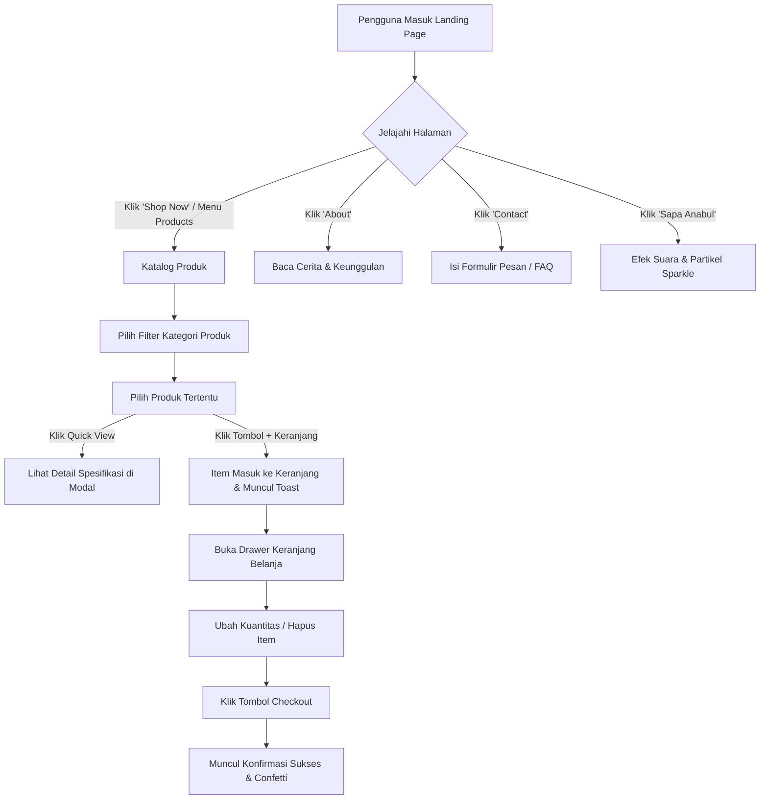

# 🐾 Dokumentasi & Alur Website Pawsy Pet Shop

Dokumentasi komprehensif rancangan, arsitektur, alur pengguna (*user flow*), dan spesifikasi teknis untuk website landing page **Pawsy Pet Shop**.

---

## 📋 1. Ringkasan Proyek
- **Nama Brand**: Pawsy Pet Shop
- **Tagline**: *"Kebutuhan Terbaik & Paling Penuh Cinta untuk Si Anabul Kesayangan 🐾"*
- **Konsep Desain**: Cute, Clean, Modern, Friendly, dan Playful.
- **Karakter Visual**: Elemen membulat (*rounded pill & squircle*), mikro-animasi lembut (*floating, bouncy hover*), ikonografi ramah, serta tata letak yang bersih dan terstruktur.

---

## 🎨 2. Sistem Desain & Palet Warna Pastel

Website ini dibangun menggunakan palet warna pastel yang lembut, hangat, dan memberikan kenyamanan visual:

| Token Warna | Nilai Hex | Fungsi / Penggunaan Utama |
| :--- | :--- | :--- |
| **Cream Light / Vanilla** | `#FFFDF7` | Background dasar halaman utama (hangat & bersih) |
| **Cream Soft Card** | `#FDF8EE` / `#FAF3E0` | Background card sekunder, badge lembut, dan footer |
| **Pastel Light Blue** | `#E0F2FE` / `#BAE6FD` | Background aksen, pill badge, container fitur |
| **Sky Blue Accent** | `#38BDF8` / `#0284C7` | Tombol CTA utama, status aktif, highlight link |
| **Soft Butter Yellow** | `#FEF9C3` / `#FDE047` | Bintang rating, countdown timer, banner promo |
| **Warm Yellow Accent** | `#F59E0B` / `#D97706` | Aksen harga diskon & ikon perhatian |
| **Pure White** | `#FFFFFF` | Background card produk, drawer, dan modal pop-up |
| **Pastel Pink (Blush)** | `#FFE4E6` / `#FB7185` | Ikon wishlist/love, tag "Best Seller", easter egg |
| **Pastel Mint (Fresh)** | `#DCFCE7` / `#22C55E` | Badge "Stok Tersedia", "100% Organik" |
| **Dark Slate Text** | `#1E293B` / `#334155` | Tipografi judul dan teks utama (kontras optimal) |
| **Muted Slate Text** | `#64748B` / `#94A3B8` | Teks pendukung, tanggal ulasan, dan placeholder |

### Tipografi
1. **Heading & Brand Font**: `Fredoka`, `Quicksand`, `Poppins` (Google Fonts) – Menghadirkan kesan ramah, bulat, ceria, dan modern.
2. **Body & Interface Font**: `Quicksand`, `Inter`, `sans-serif` – Menjamin keterbacaan tinggi pada berbagai ukuran layar.

---

## 🧭 3. Struktur Halaman & Komponen

### A. Navigation Bar (Sticky with Glassmorphism)
- **Brand Logo**: Ikon jejak kaki anabul (*Pawsy Paw*) + Tipografi *"Pawsy"* bergradasi pastel.
- **Navigasi Utama**:
  - `Home` (`#home`): Menuju puncak halaman & hero banner.
  - `Products` (`#products`): Menuju katalog produk & filter kategori.
  - `About` (`#about`): Menuju cerita, visi, dan keunggulan Pawsy.
  - `Contact` (`#contact`): Menuju formulir pesan cepat, kontak WhatsApp, & FAQ.
- **Aksi Cepat**:
  - 🛒 **Tombol Keranjang**: Membuka drawer keranjang belanja beserta penunjuk jumlah item aktif.
  - 🚀 **Tombol "Shop Now"**: Tombol CTA utama dengan efek hover bouncy yang langsung mengarahkan pengguna ke katalog produk.
  - 📱 **Mobile Toggle**: Tombol hamburger responsif untuk perangkat ponsel.

---

### B. Hero Section (Banner Utama)
1. **Headline Atraktif**: *"Semua Kebutuhan Si Anabul Tersayang, Ada di Sini! 🐾"*
2. **Sub-headline**: Makanan bernutrisi, camilan sehat, mainan interaktif, hingga perlengkapan mandi terbaik dengan standar kualitas dokter hewan.
3. **CTA Buttons**:
   - `Shop Now` (Tombol utama dengan aksen Sky Blue)
   - `Lihat Promo Hari Ini` (Tombol sekunder bernuansa Cream & Soft Yellow)
4. **Hero Badges & Micro-Cards**:
   - ⭐ *Rating 4.9/5 dari 10.000+ Pawrents*
   - ✨ *100% Bahan Alami & Higienis*
   - 🚚 *Gratis Ongkir Seluruh Indonesia*
5. **Visual Showcase**: Ilustrasi anabul menggemaskan (Kucing & Anjing ceria) dengan ornamen jejak kaki melayang (*floating animation*).
6. **Key Value Proposition Ribbon**:
   - 🛡️ *Jaminan Produk Original 100%*
   - ⚡ *Pengiriman Cepat 1 Hari Sampai*
   - 🩺 *Rekomendasi Dokter Hewan*
   - 💬 *Konsultasi Perawatan Gratis 24/7*

---

### C. Katalog Produk Interaktif (*Products Section*)
1. **Filter Kategori Cepat**:
   - 🐾 *Semua Produk*
   - 🍖 *Makanan & Snack Anabul*
   - 🎾 *Mainan & Aktivitas*
   - 🛁 *Grooming & Kebersihan*
   - 🛏️ *Aksesoris, Kasur & Kandang*
   - 💊 *Kesehatan & Multivitamin*
2. **Fitur Kartu Produk**:
   - Foto produk beresolusi tinggi dengan frame pastel melengkung (*rounded 20px*).
   - Badge status: `Diskon 25%`, `Best Seller`, `Organic Choice`.
   - Tombol Love / Wishlist instan dengan animasi meletup (*heart pop effect*).
   - Rating bintang dan review count.
   - Harga asli tercoret dan harga diskon spesial.
   - Tombol **"Quick View"** untuk modal ringkasan spesifikasi.
   - Tombol **"+ Keranjang"** (*Add to Cart*) dengan notifikasi toast konfirmasi seketika.

---

### D. Fitur Keranjang Belanja Slide-Over (*Interactive Cart Drawer*)
1. **Panel Samping Interaktif**: Terbuka secara mulus (*smooth sliding drawer*) tanpa me-refresh halaman.
2. **Manajemen Item**:
   - Tambah & kurangi kuantitas produk (*+ / -*).
   - Hapus item tertentu dari daftar belanja.
   - Indikator keranjang kosong (*Empty State*) yang ramah dengan tombol ajakan belanja.
3. **Perhitungan Otomatis**:
   - Subtotal harga barang.
   - Estimasi diskon promo.
   - Total akhir pesanan (*IDR*).
4. **Simulasi Checkout**:
   - Tombol *"Proses Pesanan Sekarang"*.
   - Pop-up modal konfirmasi sukses lengkap dengan nomor resi simulasi dan efek perayaan (*confetti animation*).

---

### E. Banner Promo & Flash Sale Mingguan
- Countdown timer interaktif (Jam : Menit : Detik).
- Kode kupon khusus: `PAWSYLOVE20` dengan tombol salin otomatis (*one-click copy*).
- Paket bundling hemat perlengkapan anabul.

---

### F. Section "Kenapa Memilih Pawsy?" (*Why Choose Us*)
Empat pilar keunggulan dengan kartu bergradasi pastel:
1. 🌿 **Nutrisi Alami & Higienis**: Bahan pilihan bebas pengawet berbahaya.
2. 🚀 **Pengiriman Kilat & Ekstra Aman**: Dilengkapi bubble wrap dan kemasan antibocor.
3. 🩺 **Konsultasi Gratis Dokter Hewan**: Panduan pemilihan pakan tepat untuk anabul.
4. ❤️ **Pawsy Peduli Shelter**: Setiap pembelian mendonasikan 2% untuk shelter kucing/anjing telantar.

---

### G. Section "Tentang Kami" (*About Us*)
- Kisah Pawsy Pet Shop yang lahir dari kecintaan mendalam terhadap hewan peliharaan.
- Statistik pencapaian:
  - 🐱 **15.000+** Anabul Bahagia
  - 📦 **500+** Produk Pilihan Terbaik
  - 🎖️ **99.2%** Tingkat Kepuasan Pelanggan

---

### H. Testimoni Pelanggan (*Pawrents Feedback*)
Ulasan otentik dengan foto profil anabul:
- 🐕 *Luna the Golden Retriever* – "Cemilan favorit Luna selalu beli di Pawsy, bulunya makin lebat dan sehat!"
- 🐈 *Mochi the British Shorthair* – "Tempat tidur dan mainan catnipnya super empuk dan lucu, pengiriman cepat banget!"
- 🐩 *Milo the Toy Poodle* – "Shampoo grooming aromanya tahan lama, tidak bikin iritasi di kulit Milo!"

---

### I. Fitur Spesial: Easter Egg "Sapa Si Anabul 🐶🐱"
- Tombol interaktif menggemaskan di sudut halaman.
- Saat diklik, membunyikan nada melodi ceria (*Web Audio API*) dan memancarkan efek partikel jejak kaki & hati melayang ke seluruh layar.

---

### J. Section Kontak, FAQ & Lokasi
1. **Formulir Kirim Pesan Cepat**:
   - Input Nama, No. WhatsApp/Email, Jenis Hewan (Anjing/Kucing/Lainnya), dan Isi Pesan.
   - Validasi formulir interaktif dan notifikasi toast sukses kirim.
2. **Informasi Toko**:
   - 📍 *Alamat: Jl. Fluffy Paw No. 88, Kebayoran Baru, Jakarta Selatan*
   - ⏰ *Jam Buka: Senin - Minggu (08.00 - 21.00 WIB)*
   - 📞 *WhatsApp: +62 812-3456-7890*
   - ✉️ *Email: halo@pawsypetshop.com*
3. **Accordion FAQ Interaktif**:
   - Pertanyaan seputar estimasi pengiriman, garansi produk, metode pembayaran, dan konsultasi produk.

---

### K. Footer
- Ringkasan brand Pawsy & misi kesejahteraan hewan.
- Link menu cepat.
- Kolom langganan newsletter untuk klaim voucher diskon 15%.
- Ikon sosial media (Instagram, TikTok, YouTube, WhatsApp).
- Hak cipta © 2026 Pawsy Pet Shop.

---

## 🔄 4. Alur Interaksi Pengguna (*User Flow*)



---

## 💻 5. Struktur Berkas (*File Architecture*)

```
c:/laragon/www/petshop/
├── alur.md                         # [Dokumentasi Lengkap Alur & Desain Proyek]
├── public/
│   ├── index.html                  # [Halaman Landing Page Standalone / Fallback Preview]
│   ├── css/
│   │   └── style.css               # [Styling Utama: Palet Pastel, Glassmorphism, Responsive]
│   └── js/
│       └── main.js                 # [Logika Interaktif: Cart, Filter, Modal, Sound, Form]
├── resources/
│   ├── css/
│   │   └── app.css                 # [Asset CSS Laravel]
│   ├── js/
│   │   └── app.js                  # [Asset JS Laravel]
│   └── views/
│       └── welcome.blade.php       # [Blade Template Halaman Landing Page Laravel]
└── routes/
    └── web.php                     # [Rute Web Laravel '/' -> 'welcome']
```

---

## 🚀 6. Cara Menjalankan & Menguji
1. **Via Laragon / Apache Server**: Akses URL virtual host (contoh: `http://petshop.test` atau `http://localhost/petshop/public`).
2. **Via Laravel Artisan Dev Server**: Jalankan `php artisan serve`, lalu buka `http://127.0.0.1:8000`.
3. **Via Browser Langsung**: Buka berkas `public/index.html` langsung di browser pilihan Anda.

---
*Dokumentasi ini dibuat untuk memastikan konsistensi desain, kejelasan alur, dan kualitas kode yang bersih dan terstandarisasi.*
